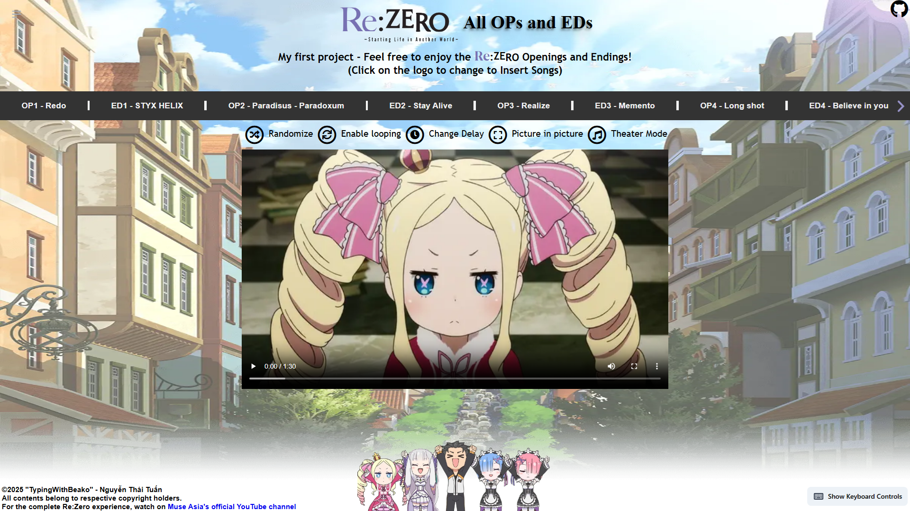

# 🎬 Re:Zero Openings and Endings Video Player

## 🚨 Important Recommendation

**For the optimal experience:** Please use **Chrome Dev 136+** when accessing this player.

There's currently an issue with video and audio sync when using in background on **Chrome 135 and earlier**, so please download **Chrome Dev** or wait until **04/29/2025** and update Chrome to version 136.

**[Download Chrome Dev here](https://www.google.com/intl/en/chrome/dev/)**
 

## 📋 Overview

A web-based video player for Re:Zero's Openings, Endings, and Insert Songs. The core video logic is built with **pure HTML, CSS, and JavaScript**, enhanced with modern web technologies to provide a **smooth** and **vibrant** experience.

### ⚠️ Disclaimer

This project uses Re:Zero content licensed by **Muse Asia**:

- Openings
- Endings (including Season Endings)
- Insert Songs

All rights reserved by their respective copyright owners.

For the complete Re:Zero experience, please watch on the **[official Muse Asia YouTube channel](https://www.youtube.com/watch?v=7F5rns5lX6g)**.

This is an **educational** project and is **not used for profit**.

### 🤔 Why This Project?

I created this project to learn the fundamentals of web development while solving a personal need - to easily **watch Re:Zero Openings, Endings, and Insert Songs**. This project has helped me understand more about **browser APIs, state management**, and **performance optimization**.

### ⏱️ Development Timeline

09/20/2024 - 04/28/2025 (= 7 months+)

## 🔮 Philosophical Meaning of the Project

> **"Let's start from here, from square one. No,.. from zero!"** - Rem, Re:Zero

### 💫 Connection to Re:Zero

This project was born because Re:Zero **saved my life** during a dark period. After achieving recognition in a national English competition, I realized people only cared about the medal, not the person behind it. That emptiness pushed me into depression for nearly a year.

Re:Zero came to me then, with its message about starting over from zero and persevering toward something truly meaningful. Like Subaru, I decided to begin anew—not to win awards or recognition, but to create something genuinely valuable to myself.

Starting from zero with no programming experience, I used the most fundamental tools to build this player. Through more than 500 commits over 7+ months, this project has become living proof of Re:Zero's powerful message: **Starting from zero and achieving the impossible through unwavering determination**.

### 🧱 The Most Primitive Approach

This project uses **pure HTML, CSS, and JavaScript** for its core functionality. Like Subaru who had to learn everything from zero, I created this project using the most basic elements *(Actually because I didn't know any frameworks when starting the project 😅)*:

- 🏗️ **Hand-crafted** HTML elements
- 🎨 **Basic** CSS features
- 📝 **Simple** JavaScript syntax
- 🔌 **Built-in** Browser APIs

### 💝 The True Meaning of the Project

This project wasn't created because I needed **recognition** or to **demonstrate my technical skills**. Just as Subaru only cares about protecting those he cares for, this project has only one driving motivation: **to watch Re:Zero perfectly**. The technical features are merely side effects of that desire.

## 💻 Technology

### 🧱 Core Technology
The core video player logic is built entirely with:

- **HTML:** Creating the page structure
- **CSS:** Building the user interface
- **JavaScript:** Managing video playback logic

> 💡 All core features are built from zero, without using frameworks.

### 🔌 Supporting Libraries

Secondary features are supported by:

- **Tailwind CSS:** Supporting interface design
- **Flowbite:** Supplementing UI components
- **jQuery:** Simplifying some interactions + creating loading screen
- **MicroModal:** Managing modal dialogs

### 💻 Minimum Hardware Requirements

This project was developed on an unstable laptop:

- 🔲 **CPU:** Intel Core i5-3337U (2013) 
  > If your laptop was purchased after 2013, congratulations, you've exceeded the requirements.

- 🧠 **RAM:** 4GB DDR3 
  > Just one browser tab is all you need to run the project.

- 💾 **Storage:** HDD 5400rpm
  > If you have an SSD, the project will run unbelievably fast.

- ⚡ **Power:** Degraded battery with 30 minutes left
  > The project was still completed despite the laptop shutting down frequently.

🚀 **Fun fact:** This project was developed on a laptop older than many modern phones, but still runs smoother than YouTube on any device.

## ✨ Features

- 🔄 **Dynamic Content Switching:** Seamlessly switch between Opening, Ending, and Insert Song videos.
- 🖼️ **Picture-in-Picture Mode:** Watch videos while multitasking.
- 🎭 **Theater Mode:** Immerse yourself in a cinema-like viewing experience.
- ⌨️ **Keyboard Shortcuts:** Control the video player with convenient keyboard shortcuts.
- 🎵 **Media Session API Integration:** Control playback from your browser or device media controls.
- 📱 **Responsive Design:** Enjoy a consistent experience across various screen sizes and devices.
- 🔀 **Randomize Videos:** Mix up the video playlist for a fresh experience.
- 🔁 **Video Looping:** Enable continuous playback of your favorite videos.
- ⏱️ **Delay Adjustment:** Customize the delay between videos for a personalized viewing experience.
- ⚡ **Smart Preloading:** Seamlessly transition to the next video without buffering.
- 📲 **PWA Support:** Install as an app on your device and access faster on subsequent visits.
- ⚙️ **Settings Persistence:** Remember your preferred settings (volume, delay, controls) between sessions.
- ☁️ **Videos Hosted on Cloudflare R2**: Store and distribute video content with high performance.

## 📸 Screenshots

-  **Main Page**

 

-  **Main Page (with video description)**

 

-  **Main Page (with title and control buttons from Media Session API)**

 

-  **Theater Mode**

## 🚀 How to Use
  
- Use the player directly at [https://re-zero-en.pages.dev](https://re-zero-en.pages.dev)

### 📝 Notes

- Videos will **automatically be cached** after you watch them **once** and will **not need to be downloaded again** on subsequent viewings.
- You can **install the app** for more convenient usage.

## ⌨️ Keyboard Shortcuts

-  `Space`: Play/Pause
-  `←`/`→`: Previous/Next Video
-  `↑`/`↓`: Increase/Decrease Volume
-  `0-9`: Play Specific Video (number 1 corresponds to the first video)
-  `Tab`: Switch between Openings/Endings and Insert Songs
-  `Q`: Randomize current playlist
-  `W`: Toggle Video Looping
-  `E`: Change Delay
-  `R`: Toggle Picture-in-Picture Mode
-  `F`: Toggle Fullscreen Mode
-  `T`: Toggle Theater Mode
-  `D`: Play "Theater D"
-  `O`: Play "Season 1 Ending"
-  `P`: Play "Season 2 Ending"
-  `S`: Play "STYX HELIX (slow version)"
-  `Escape`: Exit Theater Mode
-  `B`: Switch between cut and full versions of "STYX HELIX"

## 👥 Contributing

Contributions are welcome! Please submit Pull Requests or open issues to suggest improvements or report bugs.

## 📄 License

MIT License

## 👨‍💻 Author

Nguyen Thai Tuan
